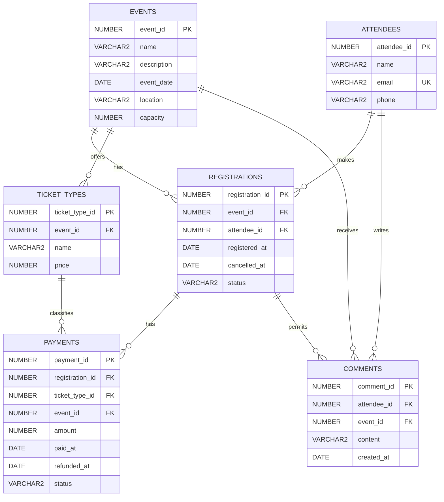

# Shared Database Model

The two modules share six Oracle tables. See [`db/schema.sql`](../db/schema.sql) for exact types, lengths, defaults and constraints.

## Tables

| Table | What it stores |
|---|---|
| `events` | Event details, date, location and capacity. |
| `attendees` | Attendee names and contact details. |
| `registrations` | Each attendee's registration for an event, its status and its latest registration and cancellation dates. |
| `ticket_types` | The ticket options and prices for each event. |
| `payments` | Payment records for registrations, including free tickets and refund dates. |
| `comments` | Event feedback from registered attendees. |

## ER diagram

`PK` means primary key. `FK` means foreign key. `UK` means unique key. Each line connects one parent record to zero or more child records.

## Data rules

- An attendee can have only one registration per event. This includes cancelled registrations. The pair `(event_id, attendee_id)` is unique.
- Each ticket type belongs to one event. Different events can have different ticket prices. Names do not have to be unique.
- A payment must use a registration and a ticket type from the same event. Two foreign keys use `payments.event_id` to enforce this rule.
- A registration can have only one active payment: `pending` or `paid`. After a refund, a new payment is allowed.
- A comment requires a registration for that attendee and event. The registration can have any status, including `cancelled`.
- Oracle blocks deletion of a registration that has comments or payments. A status change does not delete the registration.
- Capacity must be a positive integer. Prices and amounts can be zero, but cannot be negative.
- Required names, emails and comments cannot contain only whitespace.
- Store emails as `LOWER(TRIM(email))`. The database rejects other forms; it does not change the input. Emails must be unique.

## Statuses and payment dates

Registrations use `pending`, `confirmed` or `cancelled`. Payments use the states below. Both tables default to `pending`.

| Payment status | `paid_at` | `refunded_at` |
|---|---|---|
| `pending` | Null | Null |
| `paid` | Required | Null |
| `refunded` | Required | Required; not before `paid_at` |

`paid_at` records when the payment is complete. For a free ticket, it records when the zero-amount operation is complete. A refund keeps the original payment date and amount.

The application sets payment dates with each status change. These columns have no default. SQL constraints check the current values, not past status changes.

## Registration changes

Cancel a registration with a status update, not a row deletion. Reuse the same row when the attendee registers again.

| Action | New status | `registered_at` | `cancelled_at` |
|---|---|---|---|
| First registration | `pending` | Set to the current UTC time | Null |
| Confirm | `confirmed` | Keep the value | Keep the value |
| Cancel | `cancelled` | Keep the value | Set to the current UTC time |
| Register again | `pending` | Set to the current UTC time | Keep the last cancellation time |

`registered_at` stores the latest registration time. `cancelled_at` stores the latest cancellation time. Earlier dates are not retained.

A cancelled registration must have `cancelled_at` at or after `registered_at`. An active registration can retain an older cancellation date. Use `status` to identify its current state.

The application updates the status and dates together. Check capacity again before reactivation. These actions do not automatically change payments or remove comments. The service must define how to handle existing payments.

## Time conventions

- Store `registered_at`, `cancelled_at`, `paid_at`, `refunded_at` and `created_at` in UTC. Oracle `DATE` does not store a time zone.
- `registered_at` and `created_at` default to the current UTC date and time. Applications must also use UTC for values they supply.
- Keep both the date and time in Java for these fields. `LocalDate` stores only the date and loses the time.
- `event_date` is the venue's local calendar date. Use `LocalDate` without UTC conversion. The project uses one business time zone, which the team must specify.
- Convert UTC values to local time for display. For reports, convert them to the business time zone before grouping by day or month.

## Application requirements

- Check capacity in a transaction that handles concurrent requests.
- Check that a new payment amount matches its ticket price. Get `payments.event_id` from the registration.
- Allow payment transitions from `pending` to `paid`, then from `paid` to `refunded`.
- Normalize emails before writes and lookups. Validate the email format separately.
- Use JPA `AttributeConverter` implementations to store enum values in lowercase. Do not also use `@Enumerated` on those fields.
- Apply these data rules to the seed generator as well as the application.

## Create and reset the schema

Use SQL*Plus with the application database user. The target is Oracle AI Database 26ai Free, image `23.26.3.0`.

- Run [`db/schema.sql`](../db/schema.sql) when the six tables do not exist. It creates the schema; it does not update existing tables.
- Run [`db/drop.sql`](../db/drop.sql) only to reset development data. It displays the connection and a warning, then deletes without confirmation.
- The reset requires `DROP TABLE IF EXISTS` support. It succeeds when tables are absent. `PURGE` permanently removes tables and data.
- Oracle commits DDL automatically. `ROLLBACK` cannot undo a completed create or drop operation.
- The scripts stop on SQL errors. SQL*Plus command errors can still require manual attention.

Both module owners review changes to this model.
