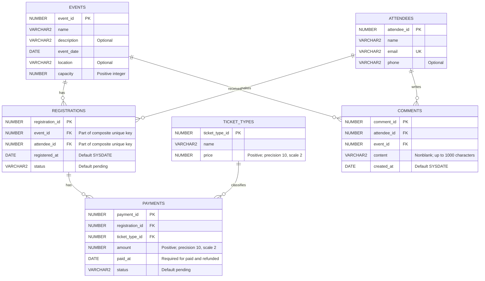

# Shared Database Model

The Events & Attendees and Payments & Reports modules share six Oracle
tables. `registrations` connects the two modules.

The diagram uses simplified type names. Exact lengths, precision,
defaults and constraints are defined in [`db/schema.sql`](../db/schema.sql).

## Entity relationship diagram

`PK` identifies a primary key, `FK` a foreign key and `UK` a unique key.
Each relationship connects exactly one parent to zero or more child records.

All columns are required except `events.description`, `events.location`,
`attendees.phone` and the conditionally nullable `payments.paid_at`.

The `uq_registration` constraint applies to the combination
`(event_id, attendee_id)`. Neither column is individually unique.

## Design decisions

### Identifiers and relationships

- Primary keys use `GENERATED BY DEFAULT AS IDENTITY`.
- Every registration references one existing event and one existing attendee.
- An attendee can have at most one registration per event, including
  cancelled registrations.
- Every payment references one existing registration and one existing
  ticket type.
- Multiple payments per registration remain possible, matching the
  original project model.
- Every comment references one existing attendee and one existing event.
  The schema does not require the attendee to be registered for that event.
- Foreign keys prevent deleting referenced records. Cascading deletes
  are not enabled.

### Values and validation

- Event capacity must be a positive integer.
- Ticket prices and payment amounts must be greater than zero.
- Monetary values use `NUMBER(10,2)`.
- Event, attendee and ticket type names, attendee emails and comment
  content must contain at least one non-whitespace character.
- Text columns use explicit character-length semantics with
  `VARCHAR2(n CHAR)`.
- Attendee emails are unique according to the database comparison rules
  for the stored values. This change does not normalize case or trim
  surrounding whitespace.
- Event names and ticket type names are not unique. Reports should group
  by identifiers as well as names to avoid combining different records.

### Statuses and dates

| Table | Allowed statuses | Default |
|---|---|---|
| `registrations` | `pending`, `confirmed`, `cancelled` | `pending` |
| `payments` | `pending`, `paid`, `refunded` | `pending` |

- Statuses are required and stored in lowercase.
- `registered_at` and `created_at` are required and default to `SYSDATE`.
- Defaults apply when the column is omitted from an insert; explicitly
  inserting `NULL` into a required column is rejected.
- Pending payments must have a null `paid_at`.
- Paid and refunded payments must have a non-null `paid_at`.
- `paid_at` records when payment was received. A refund preserves the
  original payment date.
- Date columns retain the Oracle `DATE` type from the project guide.

### Indexes

Primary and unique constraints provide indexes for their keys.
Additional indexes cover:

- `registrations.attendee_id`
- `payments.registration_id`
- `payments.ticket_type_id`
- `comments.attendee_id`
- `comments.event_id`
- `events.event_date`

The composite unique key on `(event_id, attendee_id)` already supports
lookups starting with `registrations.event_id`.

## Application responsibilities

The schema enforces row-level checks, uniqueness and referential integrity.
Application services must also:

- Validate available capacity within a transaction, including concurrent
  registration requests.
- Define which registration statuses count toward capacity.
- Define cancellation and re-registration behavior while respecting the
  unique event/attendee pair.
- Validate payment amounts against ticket prices when payments are created.
- Enforce the allowed payment transitions: `pending` to `paid`, then
  `paid` to `refunded`.
- Update payment status and payment date together when receiving payment.
- Validate email format and apply any agreed email normalization policy
  consistently when storing and looking up attendees.
- Decide whether commenting requires registration.
- Define whether ticket distribution reports count payments or distinct
  registrations, and which payment statuses they include.
- Translate validation and integrity failures into appropriate API responses.

## Schema creation and reset

- Run [`db/schema.sql`](../db/schema.sql) with SQL*Plus as the application
  schema owner, after creating the application user.
- The creation script expects the six application tables not to exist.
- `SET SQLBLANKLINES ON` allows blank lines inside SQL statements.
- Run [`db/drop.sql`](../db/drop.sql) only when intentionally resetting
  the development database.
- The reset script drops tables in reverse dependency order and uses
  `IF EXISTS` to support absent tables or partially created schemas.
- `PURGE` permanently removes the dropped tables and their data.
- Scripts exit on SQL or operating-system errors. SQL*Plus command errors
  are not covered by `WHENEVER SQLERROR`.
- Oracle DDL commits implicitly. A failure can leave a partially created
  or partially removed schema; `ROLLBACK` does not undo completed DDL.

Changes to this shared model must be reviewed by both module owners.
